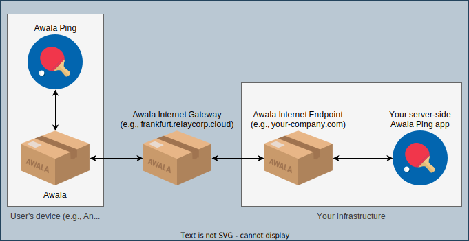
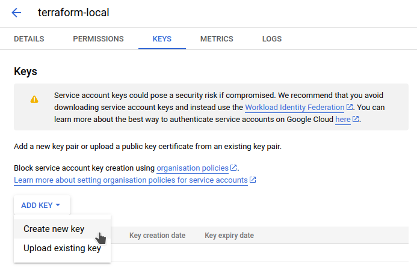
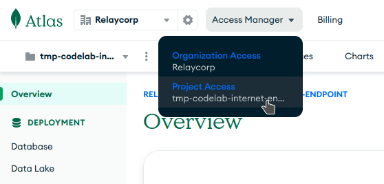
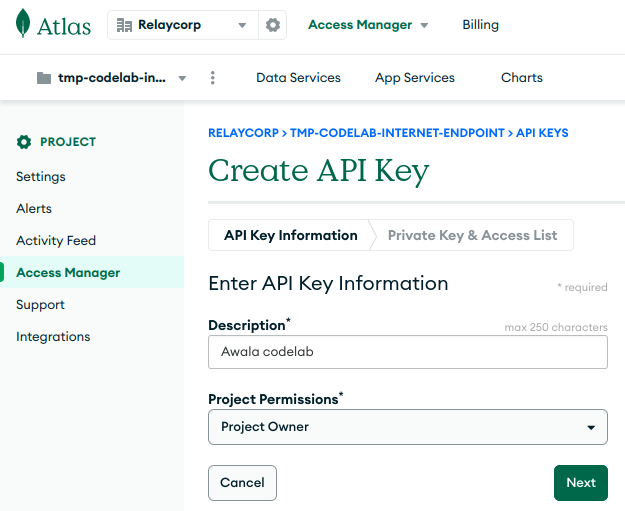
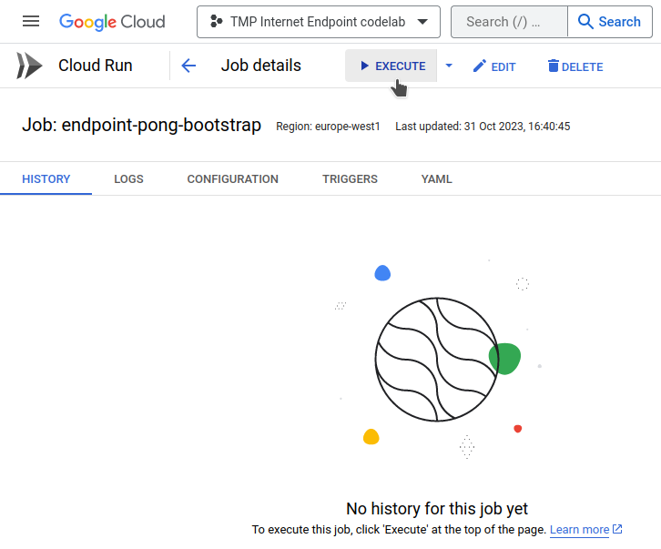

# Build and deploy a server-side app

## What you'll achieve

**You'll build and deploy a server-side app that sends and receives data via Awala**. Think of it as a "Hello world" tutorial -- the app itself will be trivial because it just communicates with [Awala Ping](https://play.google.com/store/apps/details?id=tech.relaycorp.ping).

The following diagram illustrates the architecture of the app you'll build, and where it fits the in the Awala network as it communicates with Awala Ping:



Awala-compatible, server-side apps can be written in any language and deployed to any platform, but this codelab will only use examples in Node.js and Kotlin on [Google Cloud Platform](https://cloud.google.com/).

You shouldn't need more than 30 minutes to complete the codelab, once the pre-requisites are met.

## Pre-requisites

- Familiarity with either Node.js or Kotlin (we may add more examples in the future).
- A domain name with DNSSEC correctly configured. Use [DNSSEC Analyzer](https://dnssec-analyzer.verisignlabs.com/) to verify this.
- A [Google Cloud Platform](https://cloud.google.com/) account with billing configured.
- A [MongoDB Atlas](https://www.mongodb.com/atlas/database) account with billing configured.
- [Terraform](https://developer.hashicorp.com/terraform/downloads) v1.5+.
- [Docker](https://docs.docker.com/engine/install/).
- A [Docker Hub](https://hub.docker.com/) account, so you can deploy the Docker image you'll create.
- An Android device, so you can test your app end-to-end.

## Estimated costs

To the best of our knowledge, this codelab _shouldn't_ cost anything if you're able to use the free tier of GCP and MongoDB Atlas -- otherwise, it _should_ cost less than $4/day or a few cents per minute as of this writing.

Having said this, you're solely responsible for any costs incurred whilst following this codelab. We're only offering an estimate based on our own experience, not a guarantee.

Make sure to [clean up at the end](#clean-up) to avoid incurring in further costs.

## Troubleshooting

If something doesn't work as expected at any time, [check out the final code](https://github.com/AwalaNetwork/website-dev/tree/main/codelabs/aie-gcp/) or [ask for help](../help.md).

## Steps

### 1. Set up your development environment

Open your terminal and create the directory `aie-gcp` with two subdirectories: `codelab-tf` and `codelab-app`. For example:

```shell
mkdir -p aie-gcp/infrastructure aie-gcp/app
```

`infrastructure/` will contain the Terraform code to manage your GCP and MongoDB Atlas resources, whilst `app/` will contain the code for your app.

Next, create the file `air-gcp/infrastructure/providers.tf` with the following content to configure the Terraform providers you'll use:

```hcl
terraform {
  required_providers {
    google = {
      version = "~> 4.84.0"
    }
    mongodbatlas = {
      source  = "mongodb/mongodbatlas"
      version = "~> 1.10.2"
    }
  }
}
```

Finally, initialise your workspace and install the providers above:

```shell
terraform init
```

### 2. Create and configure a new GCP project

First, configure your GCP project as follows:

1. [Create a new project from the GCP Console](https://console.cloud.google.com/projectcreate).
2. [Create a new service account](https://console.cloud.google.com/iam-admin/serviceaccounts/create) with the _Owner_ (`roles/owner`) role.
3. Generate a new key for the service account you just created from the "Keys" tab, and save the JSON file to disk.
   
4. Enable the [Cloud Resource Manager API](https://console.developers.google.com/apis/api/cloudresourcemanager.googleapis.com/overview).

Next, integrate your project in Terraform:

1. Create `aie-gcp/infrastructure/gcp.tf` with the following content:
   ```hcl
   variable "google_project_id" {}
   variable "google_credentials_path" {}
   variable "google_region" {
     default = "europe-west1"
   }
   
   locals {
      gcp_services = [
         "run.googleapis.com",
         "compute.googleapis.com",
         "cloudkms.googleapis.com",
         "pubsub.googleapis.com",
         "secretmanager.googleapis.com",
         "iam.googleapis.com",
      ]
   }
   
   provider "google" {
      project     = var.google_project_id
      credentials = file(var.google_credentials_path)
   }
   
   provider "google-beta" {
      project     = var.google_project_id
      credentials = file(var.google_credentials_path)
   }
   
   resource "google_project_service" "services" {
     for_each = toset(local.gcp_services)
   
     service                    = each.value
     disable_dependent_services = true
   }
   ```
2. Create `aie-gcp/infrastructure/terraform.tfvars` with the following content -- make sure to replace the placeholders with the correct values:
   ```hcl
   google_project_id       = "<YOUR-GCP-PROJECT-ID>"
   google_credentials_path = "<PATH-TO-GCP-CREDENTIALS-JSON>"
   ```

Finally, get Terraform to complete the setup:

```shell
terraform apply
```

It should normally take a couple of minutes for Terraform to complete the setup.

### 3. Create and configure a new MongoDB Atlas project

1. Create a new project from [the MongoDB Atlas console](https://cloud.mongodb.com/v2).
2. Go to the Access Management section of your newly-created project.
   
3. Create an API key with the _Project Owner_ role.
   
4. Keep the browser tab open, so you can copy the public and private keys shortly.

Next, integrate your MongoDB Atlas project in Terraform and create the required resources:

1. Create `aie-gcp/infrastructure/mongodbatlas.tf` with the following content:
   ```hcl
   variable "mongodbatlas_public_key" {}
   variable "mongodbatlas_private_key" {}
   variable "mongodbatlas_project_id" {}

   provider "mongodbatlas" {
     public_key  = var.mongodbatlas_public_key
     private_key = var.mongodbatlas_private_key
   }
   
   locals {
     mongodb_db_name = "main"
     mongodb_uri     = "${mongodbatlas_serverless_instance.main.connection_strings_standard_srv}/?retryWrites=true&w=majority"
   }
   
   resource "mongodbatlas_serverless_instance" "main" {
     project_id = var.mongodbatlas_project_id
     name       = "awala-endpoint"
      
     provider_settings_backing_provider_name = "GCP"
     provider_settings_provider_name         = "SERVERLESS"
     provider_settings_region_name           = "WESTERN_EUROPE"
   }
   
   resource "mongodbatlas_project_ip_access_list" "main" {
     project_id = var.mongodbatlas_project_id
     comment    = "See https://github.com/relaycorp/terraform-google-awala-endpoint/issues/2"
     cidr_block = "0.0.0.0/0"
   }
   
   resource "mongodbatlas_database_user" "main" {
     project_id = var.mongodbatlas_project_id
      
     username           = "awala-endpoint"
     password           = random_password.mongodb_user_password.result
     auth_database_name = "admin"
   
     roles {
       role_name     = "readWrite"
       database_name = local.mongodb_db_name
     }
   }
   
   resource "random_password" "mongodb_user_password" {
     length = 32
   }
   ```
2. Store the public and private keys in `aie-gcp/infrastructure/terraform.tfvars`, as follows:
   ```
   mongodbatlas_public_key  = "<YOUR-PUBLIC-KEY>"
   mongodbatlas_private_key = "<YOUR-PRIVATE-KEY>"
   mongodbatlas_project_id  = "<YOUR-MONGODB-ATLAS-PROJECT-ID>"
   ```

Finally, get Terraform to complete the setup:

```shell
terraform apply
```

It should normally take around 3 minutes for Terraform to complete the setup.

### 4. Deploy the Awala Internet Endpoint

Now that your GCP and MongoDB Atlas projects are properly configured, we're ready to deploy the [Awala Internet Endpoint (AIE)](https://docs.relaycorp.tech/awala-endpoint-internet/) using [its Terraform module for GCP](https://registry.terraform.io/modules/relaycorp/awala-endpoint/google/latest):

1. Create the file `aie-gcp/infrastructure/endpoint.tf` with the following content:
   ```hcl
   variable "internet_address" {}
   variable "pohttp_server_domain" {}

   module "awala-endpoint" {
     source  = "relaycorp/awala-endpoint/google"
     version = "1.8.20"
   
     backend_name     = "pong"
     internet_address = var.internet_address
     
     project_id = var.google_project_id
     region     = var.google_region
     
     pohttp_server_domain = var.pohttp_server_domain
     
     mongodb_uri      = local.mongodb_uri
     mongodb_db       = local.mongodb_db_name
     mongodb_user     = mongodbatlas_database_user.main.username
     mongodb_password = random_password.mongodb_user_password.result
   }
   
   output "pohttp_server_ip_address" {
     value = module.awala-endpoint.pohttp_server_ip_address
   }
   output "bootstrap_job_name" {
     value = module.awala-endpoint.bootstrap_job_name
   }

   ```
2. Specify your DNS configuration in `aie-gcp/infrastructure/terraform.tfvars` by setting: `internet_address` (the _Awala Internet address_ of your endpoint; e.g., `your-company.com`) and `pohttp_server_domain` (the domain name of your endpoint's HTTP server; e.g., `awala.your-company.com`):
   ```hcl
   internet_address     = "your-company.com"
   pohttp_server_domain = "awala.your-company.com"
   ```
   
   Tip: The Awala Internet address of your endpoint is what Awala users actually see, so you want to set it to something they'd recognise.

Now use Terraform to deploy the AIE:

```shell
terraform init   # Run again to get the AIE module
terraform apply  # Should take ~3 minutes
```

Use the outputs from the command above to complete the remaining steps by hand:

1. Go to your DNS provider to add the following records:
   - `A` record for the HTTP server, whose IPv4 address can be found in the output `pohttp_server_ip_address`.
   - `SRV` record for your Awala Internet address, which should point to the `A` record above. For example:
     ```
     _awala-pdc._tcp.your-company.com. 3600 IN SRV 0 0 443 awala.your-company.com.
     ```
2. Go to the [Cloud Run jobs console](https://console.cloud.google.com/run/jobs) and manually execute the job specified in the output `bootstrap_job_name`.
   

### 5. Implement your app

You're basically going to implement an application that receives Awala _ping_ messages and echoes it back in the form of a _pong_ message.

In this case, because we're using Google PubSub, the app wil receive the ping messages as [POST requests](https://cloud.google.com/pubsub/docs/push#receive_push) and the app will have to use a Google PubSub client to send the pong messages.

The actual implementation depends on the language you use, so pick the one you're most comfortable with:




1. Create `aie-gcp/app/package.json` with the following content:
   ```json
   {
     "dependencies": {
       "@google-cloud/pubsub": "^4.0.6",
       "env-var": "^7.4.1",
       "fastify": "^4.24.3"
     }
   }
   ```
2. Create `aie-gcp/app/server.js` with the following content:
   ```js
   import { PubSub } from '@google-cloud/pubsub';
   import envVar from 'env-var';
   import Fastify from 'fastify';
   
   const OUTGOING_MESSAGES_TOPIC = envVar.get('OUTGOING_MESSAGES_TOPIC')
     .required().asString();
   
   const pubSubClient = new PubSub();
   
   const fastify = Fastify({ logger: true });
   
   fastify.get('/', async (_request, reply) => {
     // Used by the health check
     return reply.send('All good!');
   });
   
   fastify.post('/', async (request, reply) => {
     // Extract the message and its metadata
     const pingData = request.body.message.data;
     const pingMessageAttributes = request.body.message.attributes;
     const pingSenderId = pingMessageAttributes.source;
     const pingRecipientId = pingMessageAttributes.subject;

     // Send the pong message
     const pongEvent = {
       data: pingData,
       attributes: {
         source: pingRecipientId,
         subject: pingSenderId,
       },
     };
     const topic = pubSubClient.topic(OUTGOING_MESSAGES_TOPIC);
     await topic.publishMessage(pongEvent);
   
     return reply.send('Message processed');
   });

   const start = async () => {
     try {
       await fastify.listen({ port: 8080, host: '0.0.0.0' });
     } catch (err) {
      fastify.log.error(err);
      process.exit(1);
     }
    }
   start();
   ```
3. Now create the file `aie-gcp/app/Dockerfile` with the following content:
   ```dockerfile
   FROM node:20.3.1
   WORKDIR /tmp/app
   COPY . ./
   RUN npm install
   USER node
   CMD ["node", "--unhandled-rejections=strict", "./server.js"]
   EXPOSE 8080
   ```



1. Create `aie-gcp/app/build.gradle.kts` with the following content:
   ```kotlin
   plugins {
       application
       kotlin("jvm")
   }
   
   application {
      mainClass.set("com.example.ApplicationKt")
   }
   
   repositories {
      mavenCentral()
   }
   
   dependencies {
      implementation("org.jetbrains.kotlin:kotlin-stdlib-jdk8:1.9.10")
      implementation("io.ktor:ktor-server-core:2.3.4")
      implementation("io.ktor:ktor-server-netty:2.3.4")
   }
   ```
2. Create `aie-gcp/app/src/main/kotlin/com/example/Application.kt` with the following content:
   ```kotlin
   import com.google.cloud.pubsub.v1.Publisher
   import com.google.protobuf.ByteString
   import com.google.pubsub.v1.PubsubMessage
   import com.google.pubsub.v1.TopicName
   import io.ktor.application.*
   import io.ktor.features.ContentNegotiation
   import io.ktor.http.HttpStatusCode
   import io.ktor.request.receive
   import io.ktor.response.respond
   import io.ktor.routing.get
   import io.ktor.routing.post
   import io.ktor.routing.routing
   import io.ktor.serialization.json
   import io.ktor.server.engine.embeddedServer
   import io.ktor.server.netty.Netty
   import kotlinx.serialization.Serializable
   
   @Serializable
   data class Message(val data: String, val attributes: Map<String, String>)
   
   @Serializable
   data class MessageRequest(val message: Message)
   
   fun main() {
      val outgoingMessagesTopic = System.getenv("OUTGOING_MESSAGES_TOPIC")
      val projectName = "your-project-id"
   
      embeddedServer(Netty, port = 3000, host = "0.0.0.0") {
          install(ContentNegotiation) {
             json()
          }
          routing {
              get("/") {
                  call.respond("All good!")
              }
              post("/") {
                  val request = call.receive<MessageRequest>()
                  val pingData = request.message.data
                  val pingMessageAttributes = request.message.attributes
                  val pingSenderId = pingMessageAttributes["source"]
                  val pingRecipientId = pingMessageAttributes["subject"]
      
                  val pongEvent = PubsubMessage.newBuilder()
                      .setData(ByteString.copyFromUtf8(pingData))
                      .putAllAttributes(mapOf(
                          "source" to pingRecipientId,
                          "subject" to pingSenderId
                      ))
                      .build()
      
                  val topicName = TopicName.of(projectName, outgoingMessagesTopic)
                  val publisher = Publisher.newBuilder(topicName).build()
         
                  publisher.publish(pongEvent).get()
                  publisher.shutdown()
      
                  call.respond("Message processed")
              }
          }
      }.start(wait = true)
   }
   ```
3. Create the file `aie-gcp/app/Dockerfile` with the following content:
   ```dockerfile
   FROM gradle:7.3.1-jdk16 AS build
   WORKDIR /home/gradle/src
   COPY --chown=gradle:gradle . .
   RUN gradle shadowJar --no-daemon
   
   FROM openjdk:16-jre-slim
   EXPOSE 3000
   WORKDIR /app
   COPY --from=build /home/gradle/src/build/libs/*.jar ./app.jar
   CMD ["java", "-jar", "./app.jar"]
   ```




Finally, build the Docker image:

```shell
cd aie-gcp/app
docker build -t <YOUR-DOCKER-HUB-USERNAME>/awala-codelab .
cd -
```

### 6. Deploy your app

First, you need to get your image on Docker Hub:

1. Create the repository `awala-codelab` on [Docker Hub](https://hub.docker.com/).
2. Push your image to Docker Hub:
   ```shell
   docker push <YOUR-DOCKER-HUB-USERNAME>/awala-codelab
   ```

You can now deploy your app to Cloud Run:

1. Create `aie-gcp/infrastructure/pong.tf` with the following content in order to deploy your Docker image to Cloud Run, and make sure to replace `<YOUR-DOCKER-HUB-USERNAME>`:
    ```hcl
    resource "google_service_account" "pong" {
      project = var.google_project_id
    
      account_id   = "awala-pong"
      display_name = "Awala Pong"
    }
    
    resource "google_cloud_run_v2_service" "pong" {
      project  = var.google_project_id
      location = var.google_region
    
      name    = "awala-pong"
      ingress = "INGRESS_TRAFFIC_INTERNAL_ONLY"
    
      template {
        timeout = "300s"
    
        service_account = google_service_account.pong.email
    
        execution_environment = "EXECUTION_ENVIRONMENT_GEN2"
    
        max_instance_request_concurrency = 100
    
        containers {
          name  = "pong"
          image = "<YOUR-DOCKER-HUB-USERNAME>/awala-codelab"
    
          env {
            name  = "OUTGOING_MESSAGES_TOPIC"
            value = module.awala-endpoint.pubsub_topics.outgoing_messages
          }
    
          resources {
            startup_cpu_boost = true
            cpu_idle          = false
    
            limits = {
              cpu    = 1
              memory = "512Mi"
            }
          }
    
          startup_probe {
            initial_delay_seconds = 3
            failure_threshold     = 3
            period_seconds        = 10
            timeout_seconds       = 3
            http_get {
              path = "/"
              port = 8080
            }
          }
    
          liveness_probe {
            initial_delay_seconds = 0
            failure_threshold     = 3
            period_seconds        = 20
            timeout_seconds       = 3
            http_get {
              path = "/"
              port = 8080
            }
          }
        }
    
        scaling {
          min_instance_count = 1
          max_instance_count = 3
        }
      }
    }
    ```
2. Now create `aie-gcp/infrastructure/messages_incoming.tf` with the following content to configure Google PubSub to send messages to your app:
    ```hcl
    resource "google_service_account" "pong_invoker" {
      project = var.google_project_id
    
      account_id   = "awala-pong-pubsub"
      display_name = "Awala Pong, Cloud Run service invoker"
    }
    
    resource "google_cloud_run_service_iam_binding" "pong_invoker" {
      project = var.google_project_id
    
      location = google_cloud_run_v2_service.pong.location
      service  = google_cloud_run_v2_service.pong.name
      role     = "roles/run.invoker"
      members  = ["serviceAccount:${google_service_account.pong_invoker.email}"]
    }
    
    resource "google_pubsub_subscription" "incoming_messages" {
      project = var.google_project_id
    
      name  = "pong.incoming-pings"
      topic = module.awala-endpoint.pubsub_topics.incoming_messages
    
      ack_deadline_seconds       = 10
      message_retention_duration = "259200s" # 3 days
      retain_acked_messages      = false
      expiration_policy {
        ttl = "" # Never expire
      }
    
      push_config {
        push_endpoint = google_cloud_run_v2_service.pong.uri
        oidc_token {
          service_account_email = google_service_account.pong_invoker.email
        }
        attributes = {
          x-goog-version = "v1"
        }
      }
    
      retry_policy {
        minimum_backoff = "5s"
      }
    }
    ```
3. Finally, create `aie-gcp/infrastructure/messages_outgoing.tf` with the following content to allow your app to send messages to Google PubSub:
    ```hcl
    resource "google_pubsub_topic_iam_binding" "outgoing_messages_publisher" {
      project = var.google_project_id
    
      topic   = module.awala-endpoint.pubsub_topics.outgoing_messages
      role    = "roles/pubsub.publisher"
      members = ["serviceAccount:${google_service_account.pong.email}", ]
    }
    ```

Finally, apply your changes with Terraform:

```shell
terraform apply
```

### 7. Test your app

1. Install [Awala Ping for Android](https://play.google.com/store/apps/details?id=tech.relaycorp.ping).
2. On your Android device, download the _Connection Parameters_ file from your instance of the AIE by going to the `/connection-params.der` path. For example:
   ```
   https://awala.your-company.com/connection-params.der
   ```
3. Go to Awala Ping and import the connection parameters file you just downloaded.
4. Send a ping message to your Awala Internet address.

After a few seconds, you should receive a pong message back. 🎉

If not, go to the [Logging](https://console.cloud.google.com/logs/query) or [Error reporting](https://console.cloud.google.com/errors) consoles, and check if something has gone wrong.

## Clean up

Run `terraform destroy` to destroy all the billable resources you created. For good measure, you should also:

1. Go to the [GCP Resource Manager](https://console.cloud.google.com/cloud-resource-manager) and delete the GCP project you created.
2. Delete the [MongoDB Atlas](https://cloud.mongodb.com/v2) project you created.
3. Delete the GCP credentials file from your disk.

Finally, delete the directory `aie-gcp` and the DNS `SRV` record you created.
